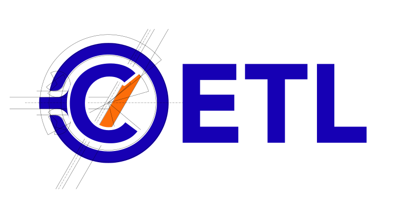

 Cyphal Embedded Template Library
===================

> We like to pronounce CETL as "settle"

## include

The include directory contains the CETL headers all within a folder, "cetl".

## CETLVaSt

> Staying with the theme, you can call this "settle-vast"

We recommend you build the CETL VerificAtion SuiTe using your target toolchain and run the suite on
your target hardware to ensure it is fully compatible. The suite is designed to work with minimal
platform I/O and does not require a filesystem. On thicker platforms, like linux, CETLVaSt can be
used to generate more robust output and even coverage reports to verify that the test suite is
covering the entire set of CETL types.

## Project Design Tenets

- **CETL supports C++14 and newer** – It is not a C++98 compatibility library, it is not a C++11 compatibility library,
and it reserves the right to increase the base support over the years as the C++ language evolves.
- **CETL does not supplant STL, ETL, boost, or any other full-featured C++ support library** – It is not a general-purpose
C++ support library and is limited to the minimum set of types needed to ensure OpenCyphal C++ projects are agnostic to
these larger projects and are easy to integrate with.
- **Where CETL types provide backwards compatibility, they should support direct replacement by newer concepts** – Where
CETL types provide functionality found in newer C++ standards the CETL version will prefer mimicking the standard over
mimicking other support libraries like Boost.
- **CETL types will never _require_ use of the default STL heap** – They may allow use of generalized heap memory and/or
the default STL allocator but will always support an alternative way to manage their memory.
- **CETL minimizes type aliasing and never injects typedef or macros into external namespaces.** – If an `std::uint8_t`
will suffice CETL uses that explicitly. If a function should be constexpr the constexpr keyword will be used. etc.
- **CETL does not use macros** – With the exception of include guard ifndef clauses, CETL does not use any C macros.
Users are in control and can write `__cplusplus` conditional includes that select CETL over STL in their own headers.
- **CETL is [Autosar C++14](https://www.autosar.org/fileadmin/standards/adaptive/20-11/AUTOSAR_RS_CPP14Guidelines.pdf)
compliant** – Where it violates Autosar rules comments will provide a clear rationale.

## Support Matrix

The following support is not guaranteed, as this is an open source project and there are no contractual obligations
agreed to by any party that contributes; however, the OpenCyphal community will use this support matrix as guidelines
to shape their work.

**Release Date** – The date after which active development of new features for a given release will cease and all updates
will be bug fixes only.

**Security Fixes** – The date after which no bug fixes will be accepted unless they are to patch critical security
vulnerabilities (See [SECURITY.md](./SECURITY.md)).

**End-Of-Life (EOL)** – The date after which no changes of any kind will be accepted.

| CETL Version | C++ Base Version | Current Maturity                                                          | Release Date | Security Fixes | EOL   |
|--------------|------------------|---------------------------------------------------------------------------|--------------|----------------|-------|
| 1.0          | C++14            |           | (TBA)        | (TBA)          | (TBA) |
